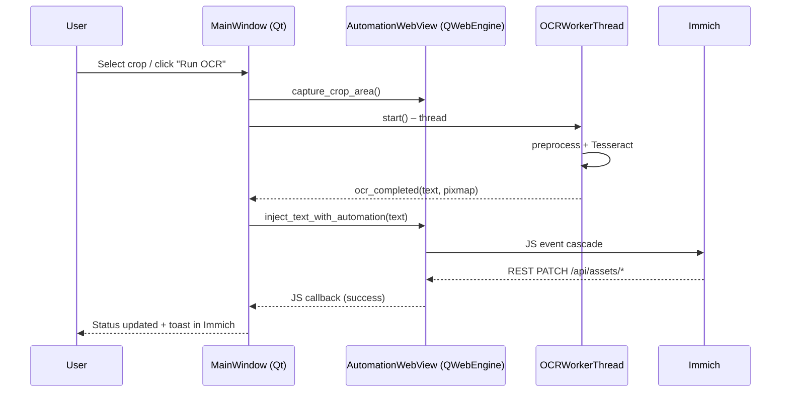

# Immich OCR Browser – V1 Core Modules Documentation

> Comprehensive technical reference for the three key Python modules that power V 1 of the **Immich OCR Browser**: `main_app.py`, `web_engine.py` and `ui_components.py` (plus the focus helper).  Use this as a single-source map when porting features to newer branches.

---

## 1  Application-level Overview



---

## 2  `main_app.py`

### 2.1  Classes

| Class | Responsibility |
|-------|----------------|
| **`OCRWorkerThread`** *(QThread)* | Runs Tesseract OCR so the UI never blocks.<br>Signals: `ocr_completed`, `ocr_failed`. |
| **`MainWindow`** *(QMainWindow)* | Top-level GUI: URL bar, crop controls, OCR cycle automation, status panel. |

### 2.2  Important Methods

* `_setup_ui()` – builds all widgets, including a `QSplitter` (80% web, 20% preview/status).
* `_run_ocr()` – performs capture, spawns `OCRWorkerThread`.
* `_on_ocr_completed()` – opens preview dialog and calls **`web_view.inject_text_with_automation()`**.
* `_automation_step()` – drives the optional hands-free loop (`OCR ➜ WAIT_SAVE ➜ NAVIGATE ➜ WAIT_LOAD`).
* `_navigate_next()` – executes JavaScript that clicks Immich’s “next” button or synthesises an Arrow-Right key.

### 2.3  UI Widgets (hierarchy excerpt)

```
MainWindow
 ├─ central_widget (QWidget)
 │   └─ main_layout (QVBoxLayout)
 │       ├─ url_layout (QHBox)
 │       ├─ control_layout (QHBox)
 │       └─ QSplitter
 │           ├─ AutomationWebView
 │           └─ bottom_widget
 │               ├─ crop_preview_label
 │               └─ StatusWidget
 └─ menuBar » File / View / Help
```

### 2.4  Signals & Slots

| Sender | Signal | Connected slot |
|--------|--------|----------------|
| `web_view` | `loadFinished(bool)` | `_on_page_loaded` |
| " | `urlChanged(QUrl)` | `_on_url_changed` |
| " | `crop_selected(QRect)` | `_on_crop_selected` |
| `SettingsDialog` | `settings_changed(dict)` | `_on_settings_changed` |

---

## 3  `web_engine.py`

### 3.1  Widget classes

* **`SelectionOverlay`** – Transparent overlay that provides rubber-band region selection. Emits `selectionFinished(QRect)`.
* **`CropWebEngineView`** – Extends `QWebEngineView`; manages crop rectangle, capture (`grab` + DPR scaling) and persistent storage.
* **`AutomationWebView`** – Adds automation helpers:
  * `load_with_automation(url)` – starts timer to run `_apply_initial_automation()` once the page finishes loading.
  * `inject_text_with_automation(text)` – executes a 300-line JavaScript sequence (five layers) that reliably writes & saves the description.

### 3.2  JavaScript Layers (all in `focus_solutions.py`)

1. **Stealth mode** – hides webdriver/headless fingerprints.
2. **Focus override** – patches `document.hidden`, `hasFocus()`, blocks `visibilitychange`.
3. **Input simulation** – native setter, full event cascade.
4. **Save triggers** – delayed Ctrl+Enter, form submit, save-button clicks.
5. **Fallback API** – if UI toast isn’t detected in 2 s, sends `fetch PATCH` directly.

### 3.3  Persistent Profile
`_setup_web_engine()` creates a `QWebEngineProfile("immich_ocr_persistent")` with its own storage path, guaranteeing cookies survive app restarts – essential so the fallback REST call is authenticated.

### 3.4  Device-Pixel-Ratio-aware Capture
`capture_crop_area()` multiplies coords by `devicePixelRatioF()` before copying the region from the widget pixmap – without this, high-DPI monitors return blurry or offset crops.

---

## 4  `ui_components.py`

### 4.1  Dialogs & Widgets

| Component | Purpose |
|-----------|---------|
| **`PreviewDialog`** | Shows crop image + extracted OCR text; allows copy to clipboard. |
| **`SettingsDialog`** | Edits runtime-config: Tesseract flags, min text length, automation toggles. Emits `settings_changed`. |
| **`StatusWidget`** | Tiny panel at bottom: *Status:* + *URL:* labels. |

### 4.2  Helper functions
`show_error_message`, `show_info_message`, `show_warning_message` – thin wrappers over `QMessageBox`.  Centralised so future styling / i18n is easy.

---

## 5  `focus_solutions.py` (support module)

| Method | Output |
|--------|--------|
| `get_stealth_script()` | JS to delete `navigator.webdriver`, spoof `plugins`, `languages`, etc. |
| `get_focus_override_script()` | JS that forces `document.hidden = false`, blocks blur events except on inputs. |
| `get_input_injection_script(text)` | Monolithic function that assembles the 8-event cascade + multi-save attempts. |
| `get_complete_automation_script(text)` | Concatenates the above three for convenience. |

The module also exposes global `focus_manager` used by both `main_app` and `web_engine`.

---

## 6  End-to-End Timing (default values)

| Segment | Delay |
|---------|-------|
| OCR thread runtime (320×240 crop) | ~100 ms – 400 ms on laptop CPU |
| verifySave timeout | 2 s (configurable via `AutomationConfig.save_timeout_ms`) |
| refocus interval | 50 ms (runs for the same 2 s window) |
| Ctrl-Enter & save-button cascade | kicks at t = 100 ms after first blur |
| Navigation load delay (loop mode) | `image_load_delay` spinbox, default 2000 ms |

---

## 7  File-level Dependencies

```text
main_app.py
 ├─ config.py
 ├─ web_engine.py
 │   ├─ focus_solutions.py
 │   └─ config.py
 ├─ ocr_processor.py
 └─ ui_components.py
```

All three core modules are self-contained; only `config.py` & PIL/Tesseract form external dependencies.

---

*Document generated automatically for V 1 commit snapshot – 2025-08-06.*